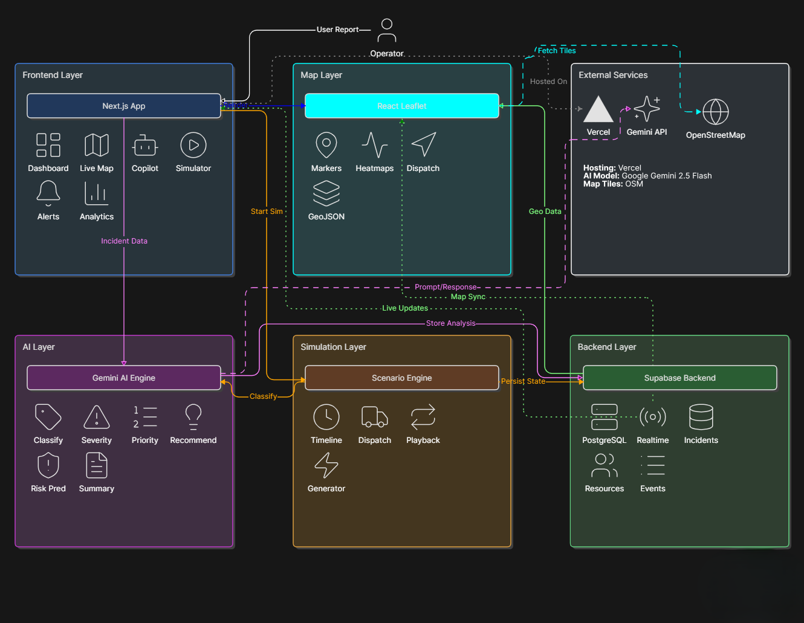
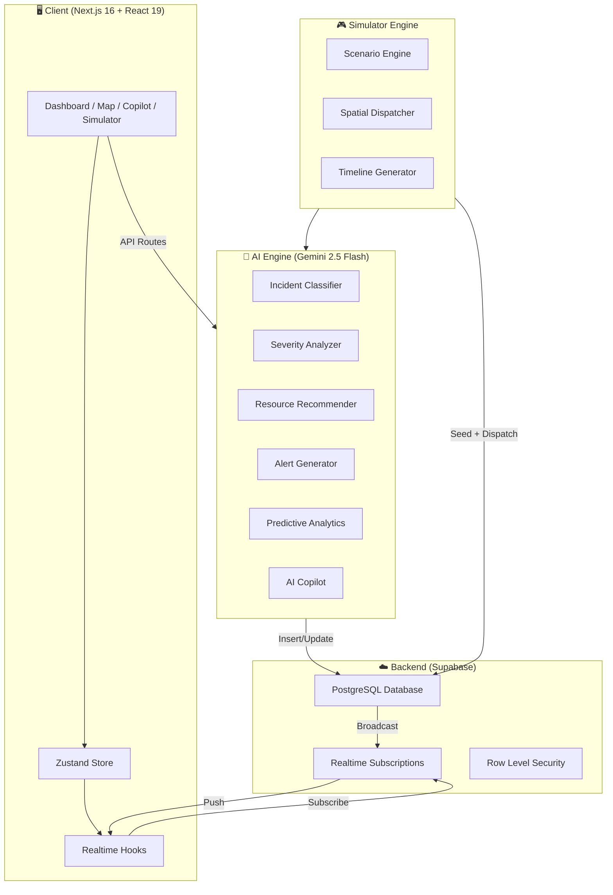
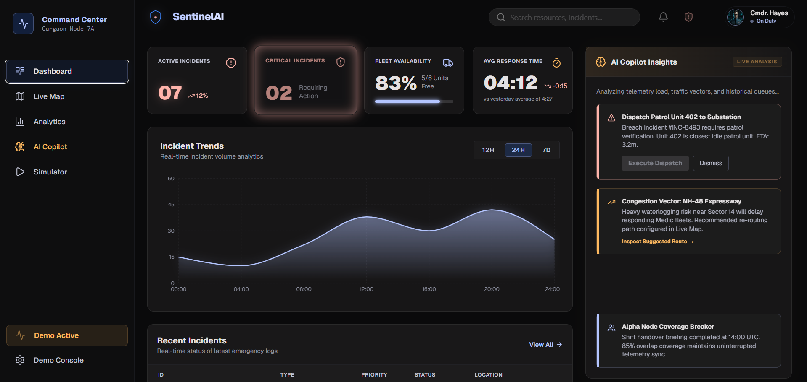
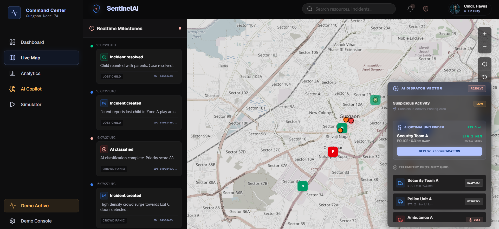
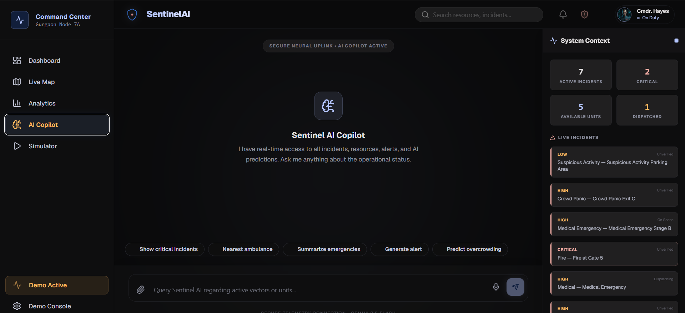
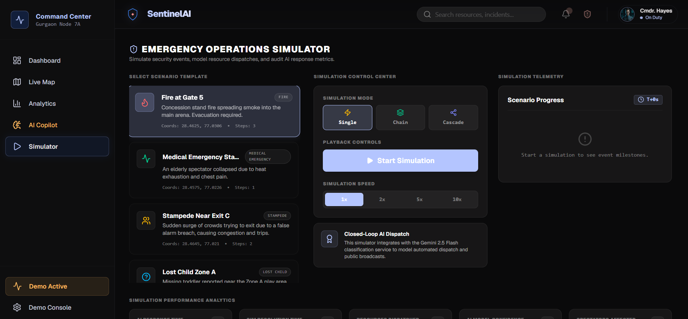
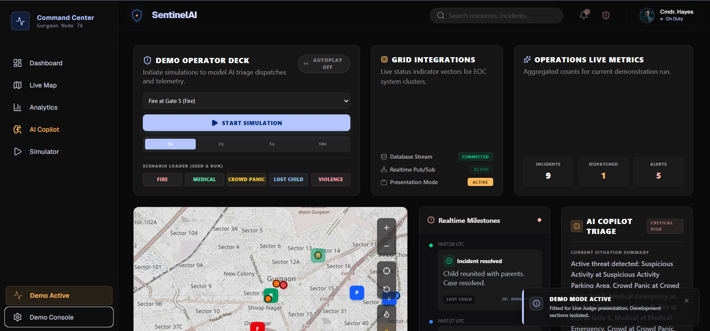
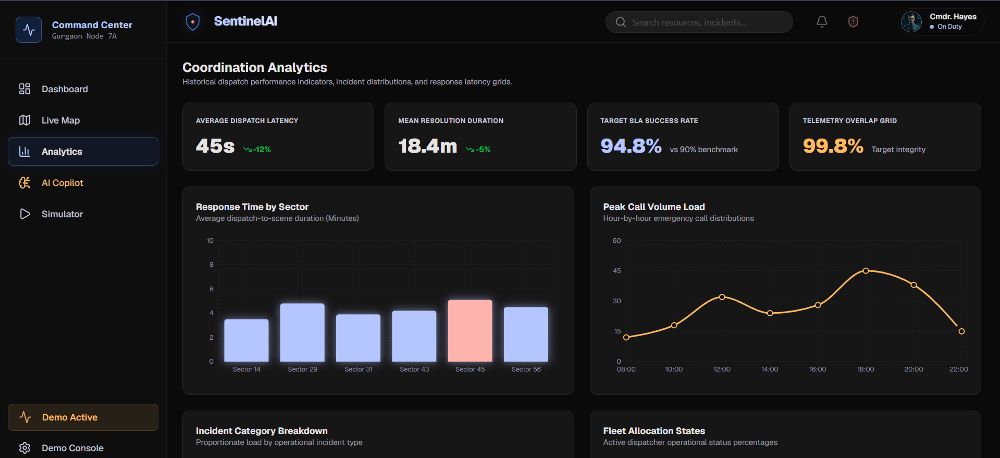

<div align="center">

# 🛡️ SentinelAI

### AI-Powered Emergency Operations Center for Large-Scale Public Events

[](https://nextjs.org/)
[](https://ai.google.dev/)
[](https://supabase.com/)
[](https://www.typescriptlang.org/)
[](https://react.dev/)
[](https://leafletjs.com/)
[](LICENSE)

**SentinelAI** transforms emergency response at stadiums, concerts, and large public gatherings from **reactive chaos** into **AI-orchestrated coordination** — classifying incidents in seconds, dispatching resources with spatial intelligence, and delivering a real-time command center that operators, responders, and AI work through together.

[Live Demo](#demo-mode) · [Architecture](#architecture) · [Get Started](#installation)

</div>

---

## 📋 Table of Contents

- [Problem Statement](#-problem-statement)
- [Solution](#-solution)
- [Features](#-features)
- [Architecture](#-architecture)
- [Tech Stack](#-tech-stack)
- [AI Engine](#-ai-engine)
- [Realtime Backend](#-realtime-backend)
- [Live Map](#-live-map)
- [AI Copilot](#-ai-copilot)
- [Emergency Simulator](#-emergency-simulator)
- [Demo Mode](#-demo-mode)
- [Folder Structure](#-folder-structure)
- [Installation](#-installation)
- [Environment Variables](#-environment-variables)
- [Deployment](#-deployment)
- [Screenshots](#-screenshots)
- [Future Scope](#-future-scope)
- [Contributors](#-contributors)
- [License](#-license)

---

## 🔴 Problem Statement

Large-scale public events (stadiums, concerts, festivals) face **life-threatening coordination failures** during emergencies:

| Challenge                      | Impact                                                         |
| ------------------------------ | -------------------------------------------------------------- |
| **Delayed incident detection** | Minutes lost before first responders are even notified         |
| **Manual triage & dispatch**   | Operators overwhelmed, wrong units sent to wrong locations     |
| **No spatial awareness**       | Dispatchers cannot see where resources are in real-time        |
| **Communication silos**        | Security, medical, and fire teams operate on separate channels |
| **Zero predictive capability** | Crowd surges and cascading events go undetected until too late |

> **Every 60-second delay in emergency response at a mass gathering increases casualty risk by 10%.**

---

## 💡 Solution

**SentinelAI** is a full-stack, AI-native Emergency Operations Center (EOC) that provides:

```
┌─────────────────────────────────────────────────────────────────┐
│                         SentinelAI                              │
│                                                                 │
│   📡 Incident Reported  →  🧠 AI Classifies (< 2 sec)          │
│                          →  📊 Severity + Priority Scored       │
│                          →  🚑 Nearest Resource Auto-Dispatched │
│                          →  🗺️  Live Map Tracks Movement        │
│                          →  📢 Public Safety Alert Broadcast    │
│                          →  ✅ Resolution Logged & Analyzed     │
│                                                                 │
│   All in real-time. All AI-driven. All in one dashboard.        │
└─────────────────────────────────────────────────────────────────┘
```

---

## ✨ Features

### Core Platform

- 🧠 **AI Incident Classification** — Gemini 2.5 Flash classifies incident type, severity, and priority in under 2 seconds
- 🚑 **Intelligent Resource Dispatch** — Spatial nearest-unit algorithm auto-assigns optimal responders
- 🗺️ **Live Coordination Map** — Real-time Leaflet map with incident markers, resource tracking, heatmaps, and dispatch vector lines
- 📊 **Coordination Analytics** — Recharts-powered dashboards for response times, resolution rates, and trend analysis
- 🔔 **Emergency Alerts** — AI-generated public safety alerts with severity classification and sector targeting

### AI Intelligence

- 🤖 **AI Copilot** — Natural language assistant for querying incidents, resources, and generating operational summaries
- 📈 **Predictive Analytics** — Crowd density prediction and cascading event risk scoring
- 🎯 **Priority Scoring** — Multi-factor AI scoring combining severity, crowd impact, and resource proximity
- 🔮 **Resource Recommendation** — AI suggests optimal resource type (Fire, Medical, Police) per incident profile

### Simulation & Demo

- 🎮 **Emergency Simulator** — 5 pre-built scenario templates with cascading event chains
- 🎬 **Demo Mode** — One-click scenario launcher with autoplay loop for live presentations
- 📽️ **Presentation Mode** — Projector-optimized font scaling and layout adjustments for judge demos

### Production Hardening

- 🛡️ **Error Boundaries** — Graceful crash recovery with reload and navigation fallbacks
- 💾 **Offline Cache** — LocalStorage fallback for incidents, resources, and alerts during connectivity drops
- 🔄 **Realtime Sync** — Supabase Postgres Changes subscriptions for live state updates across all clients
- 🍞 **Toast Notifications** — Framer Motion-powered glassmorphic status banners for all system events

---

## 🏗 Architecture




### Data Flow

```

Incident Report → API Route → Gemini Classifier → Severity Scorer
→ Priority Calculator → Resource Recommender → Auto-Dispatch
→ Supabase Insert → Realtime Broadcast → All Connected Clients

```

---

## 🛠 Tech Stack

| Layer | Technology | Purpose |
|---|---|---|
| **Framework** | Next.js 16.2.7 (App Router) | SSR, API routes, file-based routing |
| **Language** | TypeScript 5.x | Type-safe development |
| **UI Library** | React 19 | Component architecture |
| **AI Engine** | Google Gemini 2.5 Flash | Classification, recommendations, copilot |
| **Database** | Supabase (PostgreSQL) | Persistent storage with Row Level Security |
| **Realtime** | Supabase Realtime | Postgres Changes pub/sub |
| **State** | Zustand 5 | Lightweight global state management |
| **Map** | React Leaflet + Leaflet.heat | Live geospatial visualization |
| **Charts** | Recharts 3 | Analytics and trend visualization |
| **Animations** | Framer Motion 12 | Micro-interactions and transitions |
| **Icons** | Lucide React | Consistent icon system |
| **Styling** | Tailwind CSS 4 | Utility-first dark theme design system |

---

## 🧠 AI Engine

SentinelAI's AI layer is powered by **Google Gemini 2.5 Flash** with structured JSON output schemas for deterministic, type-safe responses.

```

ai/
├── gemini.ts # Gemini client initialization
├── classifier.ts # Incident type classification
├── severity.ts # Multi-factor severity analysis
├── recommendation.ts # Resource type recommendation
├── alertGenerator.ts # Public safety alert generation
├── prediction.ts # Crowd density & risk prediction
├── schemas.ts # Structured output JSON schemas
└── translator.ts # Multi-language support

````

### AI Pipeline

| Stage | Input | Output | Latency |
|---|---|---|---|
| **Classification** | Incident description | Type (Fire, Medical, Violence...) | ~1.2s |
| **Severity Scoring** | Type + location + crowd data | CRITICAL / HIGH / MEDIUM / LOW | ~0.8s |
| **Priority Calculation** | Severity + proximity + impact | Numeric score (0-100) | ~0.5s |
| **Resource Recommendation** | Incident profile | FIRE / MEDICAL / POLICE | ~0.6s |
| **Alert Generation** | Incident context | Public safety message | ~1.0s |

### Offline Resilience

When Gemini is unavailable, the AI service falls back to:
- Rule-based severity mapping from incident keywords
- Cached Q&A responses for copilot queries
- Local state summaries without API calls

---

## ⚡ Realtime Backend

SentinelAI uses **Supabase** as its realtime PostgreSQL backend with full Row Level Security.

### Database Schema

```sql
-- Core tables with realtime subscriptions
incidents        → Type, severity, coordinates, AI analysis, dispatch state
resources        → Type, coordinates, availability, assignment tracking
alerts           → Severity, message, broadcast status
incident_events  → Timeline milestones (created → classified → dispatched → resolved)
````

### Realtime Architecture

```
Supabase Postgres Changes
├── incidents   → useIncidents()   → Zustand store → Dashboard, Map, Copilot
├── resources   → useResources()   → Zustand store → Map markers, dispatch overlay
├── alerts      → useAlerts()      → Zustand store → Alert panels, notifications
└── events      → Timeline.tsx     → Local state   → Realtime milestone feed
```

### Idempotent Schema

The master schema (`supabase/schema.sql`) is fully idempotent:

- `CREATE TABLE IF NOT EXISTS` for all tables
- `ALTER TABLE ADD COLUMN IF NOT EXISTS` for schema evolution
- `DO $$ ... EXCEPTION WHEN duplicate_object` for enum safety
- Automated `updated_at` trigger for resource timestamp sync

---

## 🗺️ Live Map

The Live Coordination Map is built with **React Leaflet** and provides:

- 📍 **Incident Markers** — Color-coded by severity with popup details and AI summaries
- 🚑 **Resource Markers** — Real-time position tracking with status indicators
- 🔥 **Heatmap Overlay** — `leaflet.heat` density visualization for crowd hotspots
- ➡️ **Dispatch Vectors** — Animated lines showing resource-to-incident dispatch paths
- 🎯 **Click-to-Dispatch** — Select an incident, pick a resource, dispatch with one click

```
components/map/
├── LiveMap.tsx           # Dynamic import wrapper (SSR disabled)
├── LiveMapInner.tsx      # Core map with markers, overlays, controls
├── IncidentMarker.tsx    # Severity-coded incident pins with popups
├── ResourceMarker.tsx    # Status-coded resource pins with metadata
├── DispatchOverlay.tsx   # Dispatch vector line rendering
├── HeatmapOverlay.tsx    # Crowd density heatmap layer
└── Timeline.tsx          # Realtime milestone event feed
```

---

## 🤖 AI Copilot

An intelligent conversational assistant that acts as an **Emergency Operations Advisor**.

### Capabilities

| Query                            | Response                                                           |
| -------------------------------- | ------------------------------------------------------------------ |
| _"Show critical incidents"_      | Lists all active critical-severity incidents with locations        |
| _"Which ambulance is nearest?"_  | Calculates spatial distance to find closest available medical unit |
| _"Generate public alert"_        | Creates a broadcast-ready safety alert via Gemini                  |
| _"Summarize active emergencies"_ | AI-generated situation report across all open incidents            |
| _"Show dispatched resources"_    | Displays all busy/staged resources with assignments                |

### Architecture

```
copilot/
├── prompts.ts          # System prompts with emergency operations context
├── tools.ts            # Function calling tools (query incidents, resources, alerts)
├── parser.ts           # Response parsing and card data extraction
└── contextBuilder.ts   # Real-time context assembly from Zustand store
```

The copilot builds a **grounded context window** from live database state before every query, ensuring responses reflect the current operational picture — not stale training data.

---

## 🎮 Emergency Simulator

A complete simulation engine for modeling emergency response workflows end-to-end.

### Pre-Built Scenarios

| Scenario                     | Category   | Severity | Cascading Events                     |
| ---------------------------- | ---------- | -------- | ------------------------------------ |
| 🔥 Fire at Gate 5            | Fire       | Critical | Smoke inhalation medical emergencies |
| 🏥 Medical Emergency Stage B | Medical    | High     | —                                    |
| 🏃 Stampede Near Exit C      | Stampede   | Critical | Trample injuries                     |
| 👦 Lost Child Zone A         | Lost Child | Medium   | —                                    |
| 👊 Violence Near Entry Gate  | Violence   | High     | —                                    |

### Simulation Timeline

```
T+0   → Incident Created (inserted into Supabase)
T+5   → AI Classification (severity, priority score, confidence)
T+10  → Resource Dispatched (nearest unit assigned, begins movement)
T+20  → Safety Alert Broadcast (AI-generated public warning)
T+60  → Incident Resolved (resource released, case logged)
```

### Spatial Dispatch

The simulator includes a **real-time spatial interpolation engine** that smoothly animates resource markers from their base coordinates to the incident location over the dispatch duration, providing judges a visible, cinematic demonstration of the dispatch pipeline.

---

## 🎬 Demo Mode

SentinelAI includes a purpose-built **Demo Command Center** at `/demo` optimized for hackathon presentations and judge walkthroughs.

### Command Center Layout

```
┌──────────────────────────────────────────────────────────┐
│  TOP:  Scenario Controls │ System Health │ Live Metrics  │
├──────────────────────────────────────────────────────────┤
│  MID:  Live Map │ Realtime Timeline │ AI Copilot Triage │
├──────────────────────────────────────────────────────────┤
│  BTM:  Incidents │ Resources │ Alerts │ Analytics        │
└──────────────────────────────────────────────────────────┘
```

### One-Click Scenario Launcher

Five quick-launch buttons that each:

1. **Seed** the database with demo incidents, resources, alerts, and events
2. **Fetch** fresh state into the Zustand store
3. **Start** the simulation engine at 5x speed
4. **Populate** all panels: Dashboard, Map, Timeline, Copilot, Analytics

### Features

- 🔄 **Autoplay Loop** — Automatically cycles through all 5 scenarios
- 📽️ **Presentation Mode** — Scales fonts and spacing for projector screens
- 🏥 **System Health Grid** — Live database, realtime, and AI connection status
- 📊 **Operations Metrics** — Real-time incident count, dispatch count, alert count

### Intelligent Seed Data

The `DbSeedService` provides idempotent demo data seeding:

- **5 Incidents**: Fire at Gate 5, Medical Emergency Stage B, Crowd Panic Exit C, Lost Child Zone A, Suspicious Activity Parking Area
- **5 Resources**: Ambulance A, Ambulance B, Fire Unit A, Police Unit A, Security Team A
- **3 Alerts**: Fire alert near Gate 5, Medical assistance dispatched, Crowd control activated
- **10 Events**: Full lifecycle milestones (created → classified → dispatched → alert → resolved)

---

## 📁 Folder Structure

```
SentinelAI/
├── app/                          # Next.js App Router
│   ├── api/                      # API Routes
│   │   ├── ai/                   # AI endpoints (classify, recommend, alert)
│   │   ├── copilot/chat/         # Copilot conversation endpoint
│   │   ├── dispatch/             # Resource dispatch endpoint
│   │   ├── incidents/            # CRUD incidents
│   │   ├── resources/            # CRUD resources
│   │   ├── alerts/               # CRUD alerts
│   │   └── report/               # Incident reporting
│   ├── dashboard/                # Main dashboard page
│   ├── map/                      # Live coordination map page
│   ├── incidents/                # Incident management page
│   ├── resources/                # Resource management page
│   ├── alerts/                   # Alert control page
│   ├── analytics/                # Analytics dashboard page
│   ├── copilot/                  # AI Copilot page
│   ├── simulator/                # Emergency simulator page
│   ├── demo/                     # Demo command center page
│   ├── error.tsx                 # Error boundary
│   ├── global-error.tsx          # Global error boundary
│   ├── layout.tsx                # Root layout
│   └── globals.css               # Design system tokens
│
├── ai/                           # AI Engine
│   ├── gemini.ts                 # Gemini client
│   ├── classifier.ts             # Incident classification
│   ├── severity.ts               # Severity analysis
│   ├── recommendation.ts         # Resource recommendation
│   ├── alertGenerator.ts         # Alert generation
│   ├── prediction.ts             # Predictive analytics
│   ├── schemas.ts                # Structured output schemas
│   └── translator.ts             # Multi-language support
│
├── copilot/                      # Copilot Intelligence
│   ├── prompts.ts                # System prompts
│   ├── tools.ts                  # Function calling tools
│   ├── parser.ts                 # Response parsing
│   └── contextBuilder.ts         # Context assembly
│
├── simulator/                    # Simulation Engine
│   ├── scenarioEngine.ts         # Core simulation loop
│   ├── scenarioTemplates.ts      # 5 scenario definitions
│   ├── generateIncident.ts       # Incident payload generator
│   ├── timelineGenerator.ts      # Milestone timeline builder
│   └── dispatcher.ts             # Spatial dispatch + interpolation
│
├── components/                   # React Components
│   ├── layout/                   # Header, Sidebar, Toast, RealtimeProvider
│   ├── dashboard/                # StatsGrid, RecentIncidents, AIInsights
│   ├── map/                      # LiveMap, Markers, Heatmap, Timeline
│   ├── copilot/                  # ChatWindow, MessageBubble, Prompts
│   ├── simulator/                # ScenarioCard, Controls, Player, Stats
│   ├── demo/                     # Incidents, Resources, Alerts, Analytics panels
│   ├── incidents/                # Incident management components
│   └── charts/                   # TrendChart (Recharts)
│
├── services/                     # Service Layer
│   ├── incident.service.ts       # Incident CRUD + offline cache
│   ├── resource.service.ts       # Resource CRUD + offline cache
│   ├── alert.service.ts          # Alert CRUD + offline cache
│   ├── ai.service.ts             # AI pipeline orchestration
│   ├── copilot.service.ts        # Copilot query handling
│   ├── simulator.service.ts      # Simulator state management
│   ├── map.service.ts            # Geospatial utilities
│   └── dbSeed.service.ts         # Idempotent demo data seeding
│
├── hooks/                        # React Hooks
│   ├── useIncidents.ts           # Realtime incident subscription
│   ├── useResources.ts           # Realtime resource subscription
│   ├── useAlerts.ts              # Realtime alert subscription
│   ├── useMapIncidents.ts        # Map-specific incident hook
│   ├── useMapResources.ts        # Map-specific resource hook
│   └── useSimulation.ts          # Simulation state hook
│
├── store/                        # State Management
│   └── useSentinelStore.ts       # Zustand global store
│
├── types/                        # TypeScript Definitions
│   └── index.ts                  # Incident, Resource, Alert, Event, Toast
│
├── lib/                          # Utilities
│   ├── mappers.ts                # DB ↔ UI type mappers
│   ├── helpers.ts                # Formatting utilities
│   ├── constants.ts              # App-wide constants
│   ├── cache.ts                  # LocalStorage cache utilities
│   └── utils.ts                  # cn() classname utility
│
├── supabase/                     # Database
│   ├── client.ts                 # Supabase client initialization
│   ├── schema.sql                # Master idempotent schema
│   └── types.ts                  # Generated database types
│
└── public/                       # Static assets
```

---

## 🚀 Installation

### Prerequisites

- **Node.js** ≥ 18.x
- **npm** ≥ 9.x
- A **Supabase** project ([create one free](https://supabase.com/dashboard))
- A **Google AI Studio** API key ([get one free](https://aistudio.google.com/apikey))

### Setup

```bash
# 1. Clone the repository
git clone https://github.com/your-username/SentinelAI.git
cd SentinelAI

# 2. Install dependencies
npm install

# 3. Configure environment variables (see section below)
cp .env.example .env.local

# 4. Initialize the database
#    Run the contents of supabase/schema.sql in your Supabase SQL Editor

# 5. Start the development server
npm run dev
```

Open [http://localhost:3000](http://localhost:3000) and navigate to `/demo` for the full command center experience.

---

## 🔐 Environment Variables

Create a `.env.local` file in the project root:

```env
# Supabase Configuration
NEXT_PUBLIC_SUPABASE_URL=https://your-project.supabase.co
NEXT_PUBLIC_SUPABASE_ANON_KEY=your-supabase-anon-key

# Google Gemini AI
GEMINI_API_KEY=your-gemini-api-key

# Optional: Map Configuration
NEXT_PUBLIC_MAP_CENTER_LAT=28.4595
NEXT_PUBLIC_MAP_CENTER_LNG=77.0410
```

> **Note**: The `NEXT_PUBLIC_` prefix exposes variables to the browser. Keep `GEMINI_API_KEY` server-side only (it is used exclusively in API routes).

---

## 🌐 Deployment

### Vercel (Recommended)

```bash
# Install Vercel CLI
npm i -g vercel

# Deploy
vercel --prod
```

1. Connect your GitHub repository to [Vercel](https://vercel.com)
2. Add environment variables in the Vercel dashboard
3. Deploy — Vercel auto-detects Next.js and configures the build

### Docker

```dockerfile
FROM node:18-alpine AS builder
WORKDIR /app
COPY package*.json ./
RUN npm ci
COPY . .
RUN npm run build

FROM node:18-alpine AS runner
WORKDIR /app
COPY --from=builder /app/.next ./.next
COPY --from=builder /app/node_modules ./node_modules
COPY --from=builder /app/package.json ./
EXPOSE 3000
CMD ["npm", "start"]
```

### Production Build

```bash
npm run build    # TypeScript check + optimized production bundle
npm run start    # Start production server on port 3000
```

---

## 📸 Screenshots

> Screenshots will be added after the final design review.

| View                    | Description                                                                                              |
| ----------------------- | -------------------------------------------------------------------------------------------------------- |
| **Dashboard**           | Real-time stats grid, recent incidents, AI insights |
| **Live Map**            | Incident & resource markers, heatmap, dispatch vectors      |
| **AI Copilot**          | Natural language emergency query interface             |
| **Simulator**           | Scenario cards, timeline, stats, player controls    |
| **Demo Command Center** | Full 3-tier presentation layout                        |
| **Analytics**           | Trend charts, response time analysis                |

---

## 🔮 Future Scope

| Feature                            | Description                                                                        | Priority |
| ---------------------------------- | ---------------------------------------------------------------------------------- | -------- |
| 🎥 **CCTV Vision Integration**     | Real-time camera feed analysis with Gemini Vision for automatic incident detection | High     |
| 🎙️ **Voice Command Interface**     | Hands-free copilot interaction via Web Speech API                                  | High     |
| 📱 **Mobile Responder App**        | React Native companion app for field responders                                    | Medium   |
| 🌍 **Multi-Venue Support**         | Manage multiple venues from a single command center                                | Medium   |
| 🔗 **External System Integration** | Connect to 911/112 dispatch systems, hospital APIs                                 | Medium   |
| 📊 **Post-Event Analytics**        | Comprehensive after-action reports with AI-generated insights                      | Low      |
| 🌐 **Multi-Language Alerts**       | Auto-translate safety alerts into regional languages                               | Low      |
| 🧪 **A/B Scenario Testing**        | Compare dispatch strategies across simulated scenarios                             | Low      |

---

## 👥 Contributors

<table>
  <tr>
    <td align="center">
      <strong>Harshit</strong><br />
      <sub>Full-Stack Engineer & AI Architect</sub>
    </td>
  </tr>
</table>

---

## 📄 License

This project is licensed under the **MIT License** — see the [LICENSE](LICENSE) file for details.

---

<div align="center">

**Built with ❤️ for safer public events**

⭐ Star this repo if SentinelAI impressed you!

</div>
